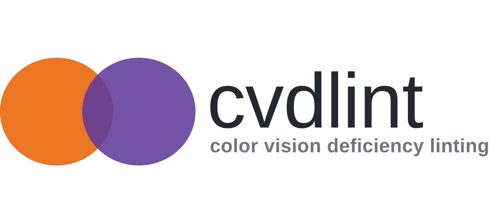

<p align="center">
  <picture>
    <source
      media="(prefers-color-scheme: dark)"
      srcset="docs/assets/cvdlint-lockup-dark.svg"
    >
    <source
      media="(prefers-color-scheme: light)"
      srcset="docs/assets/cvdlint-lockup-light.svg"
    >
    
  </picture>
</p>

<p align="center">
  <a href="https://pypi.org/project/cvdlint/">
    
  </a>
  <a href="https://pypi.org/project/cvdlint/">
    
  </a>
  
</p>

<p align="center">
  <a href="#installation">Installation</a> ·
  <a href="#usage">Usage</a> ·
  <a href="https://cvdlint.readthedocs.io/en/latest/">Documentation</a>
</p>


**cvdlint** is a static linter and Python checker for colour palettes.
It finds literal palettes in Python files and notebook code cells,
then reports colour pairs that may become confusable under common colour-vision deficiencies.
Use it as a static source-code linter, a direct
CLI/CI palette check, or through its Python API and plotting-library adapters.

It is useful for research or projects that centralise colours, as it catches
unsafe palette definitions during code review, before they spread across plots.


## Installation

Install from PyPI:

```console
pip install cvdlint
```

Install plotting adapters as needed:

```console
pip install "cvdlint[matplotlib,plotly]"
```

## Usage

### Static source-code linter

Scan all Python files and Jupyter notebooks under the current directory:

```console
cvdlint .
```

You can also scan selected files or directories:

```console
cvdlint src/ notebooks/ examples/chart.py
```

Static linting:

- recursively discovers `.py`, `.ipynb`, `.json`, `.toml`, `.yaml`, and `.yml`
  files;
- resolves palettes in lists, tuples, sets, and dictionary values;
- resolves simple variables, palette concatenation, and starred expansion;
- recognises hexadecimal colours, CSS4 named colours, and RGB tuples using
  either `0–1` or `0–255` channels;
- parses notebook code cells while ignoring markdown and saved outputs;
- carries simple constant definitions forward across notebook code cells;
- reports the file, notebook cell, line, and column of each palette;
- emits the stable rule code `CVD001` for potentially confusable pairs; and
- never imports or executes the inspected project.

Because it is static, this mode cannot generally resolve palettes returned by
functions, loaded through arbitrary application code, or assembled through
runtime control flow. Check those palettes directly with the CLI or Python API.

Each result includes the complete extracted palette and either `PASS` or its
`CVD001` findings. Interactive terminals also show colour swatches; redirected
output and CI logs retain plain hex values. Set `NO_COLOR` to disable swatches (`NO_COLOR=1 cvdlint .`).
For each failing pair, the report shows both its original colours and their
simulated appearance under the reported CVD condition at the configured
severity.

Reports identify the Machado, Oliveira, and Fernandes (2009) simulation model
and configured severity. Simulated RGB values and swatches are model-specific
approximations, so they need not exactly match applications that use another
CVD model.

### Direct CLI and CI checks

Pass a palette directly when its colours are generated elsewhere or when you
want to enforce a specific palette in CI:

```console
cvdlint --tolerance 10 '#E41A1C' '#4DAF4A' '#377EB8'
```

This checks the three colours under each supported colour-vision-deficiency (CVD)
simulation at full severity. It uses the default CIEDE2000 distance metric and
reports a failure if any simulated pair has a perceptual distance below `10`.

The CLI uses an absolute CIEDE2000 tolerance of `10` by default, so this shorter
form is equivalent:

```console
cvdlint '#E41A1C' '#4DAF4A' '#377EB8'
```

```text
usage: cvdlint [-h] [--tolerance FLOAT] [--metric METRIC]
               [--relative] [--severity FLOAT]
               TARGET [TARGET ...]
```

- `TARGET` is a Python file, Jupyter notebook, or directory to scan, or a direct
  palette colour in `#RRGGBB` format. Multiple source paths are supported; paths
  and colours cannot be mixed in one invocation.
- `--tolerance FLOAT` sets the minimum acceptable perceptual distance. It
  defaults to `10` when using CIEDE2000.
- `--relative` uses the closest pair under normal vision as the threshold. This
  reports any loss of relative distinguishability and can flag pairs that are
  still clearly distinguishable, so it is opt-in.
- `--metric METRIC` selects `CIE76`, `CIE94`, or `CIEDE2000` (the default).
  CIE76 and CIE94 require an explicit `--tolerance` or `--relative` because
  their distance scales are not interchangeable with CIEDE2000.
- `--severity FLOAT` sets the CVD simulation severity from `0.0` (none) to
  `1.0` (full; the default).
- `--exclude GLOB` excludes matching paths and can be repeated.
- `--format` selects human-readable `text`, `json`, or SARIF 2.1 output.
- `-h` or `--help` displays the command help.

Exit status `0` means pass, `1` means potentially confusable pairs were found,
and `2` means invalid input.

#### Configuration

Project defaults can be stored in `pyproject.toml`:

```toml
[tool.cvdlint]
tolerance = 10
severity = 1.0
metric = "CIEDE2000"
exclude = ["generated/**", "vendor/**"]
format = "text"
```

Set `relative = true` instead of `tolerance` to use the relative policy.
Command-line options override configuration values. Suppress an intentional
Python palette on its line with either `# cvdlint: ignore` or
`# noqa: CVD001`.

#### Pre-commit

This repository exposes a pre-commit hook. After replacing the URL and revision
with the canonical repository details, add:

```yaml
repos:
  - repo: https://github.com/a-lfns/cvdlint
    rev: v0.1.0
    hooks:
      - id: cvdlint
```

Machine-readable reports are available for CI integrations:

```console
cvdlint --format json . > cvdlint.json
cvdlint --format sarif . > cvdlint.sarif
```

### Python API

Use the API for palettes that only exist at runtime or when validation belongs
inside application tests:

```python
from cvdlint import palette_check

report = palette_check(
    ["#E41A1C", "#4DAF4A", "#377EB8"],
    tolerance=10,
)

print(report.passed)
print(report.problems)
report.raise_for_failure()
```

Like the CLI, `palette_check()` defaults to an absolute CIEDE2000 tolerance of
`10`. Use `relative=True` to make the closest normal-vision pair the threshold:

```python
report = palette_check(colours, relative=True)
```

### Plot adapters

The optional adapters extract resolved colours from already-created figures and
then use the same Python checking API:

```python
from cvdlint.adapters.matplotlib import check_figure

report = check_figure(fig, tolerance=10)
report.raise_for_failure()
```

Seaborn produces Matplotlib figures, so it uses the same adapter. Plotly and
PyROOT adapters expose `check_figure()` and `check_canvas()` respectively.

Adapters inspect colours that can be resolved from the plot object. They do not
currently resolve every possible theme default, gradient, texture, transparency
interaction, or data-driven colour expression.

## Method

The implementation:

1. parses explicit sRGB colours;
2. simulates protanopia, deuteranopia, and tritanopia with the full-dichromacy
   matrices from Machado, Oliveira, and Fernandes (2009);
3. converts normal and simulated colours to CIE Lab;
4. calculates pairwise CIEDE2000, CIE94, or CIE76 differences; and
5. reports every pair below the selected tolerance.

## Development

```console
uv sync --all-extras --dev
uv run pytest
uv run ruff check .
uv run ruff format --check .
uv run --extra docs sphinx-build -W -b html docs docs/_build/html
```

## Acknowledgements

The palette-analysis API and original relative-tolerance policy were informed
by Jakub Nowosad's R package
[colorblindcheck](https://github.com/Nowosad/colorblindcheck), whose published
results are used as compatibility references. `cvdlint` is an independent
Python implementation with its own static-linting and reporting features.

## Licence

Apache-2.0 © 2026 Alice Alfonsi
